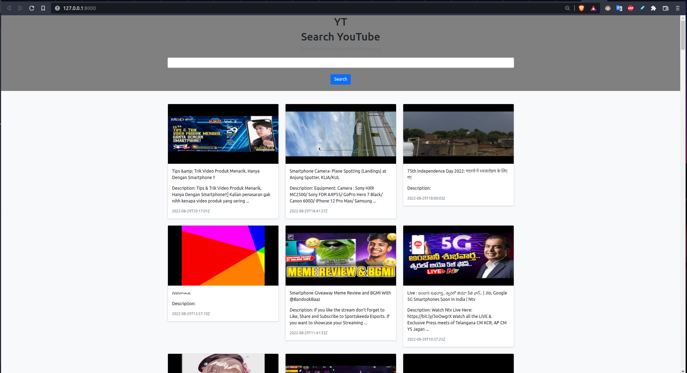

# YT Fetch Api
An API to fetch latest videos from youtube sorted in reverse chronological order of their publishing date-time from YouTube for a given tag/search query in a paginated response.

The server fetches latest videos async after every 10 minutes and saves it to the db.

This project is completely based on Django.

## Setup Guide
- Clone the project
- As this project is based on Django, your system need to have proper python setup, refer [this](https://www.python.org/downloads/)
- Go the project through the terminal and install all dependencies by using typing `pip install -r requirements.txt` in the terminal
- Run the server using `python mange.py runserver`

# key features

- multiple API keys so that if quota is exhausted on one, it automatically uses the next available key.
- Entire application can be delpoyed with the help of docker 

## Screenshots

